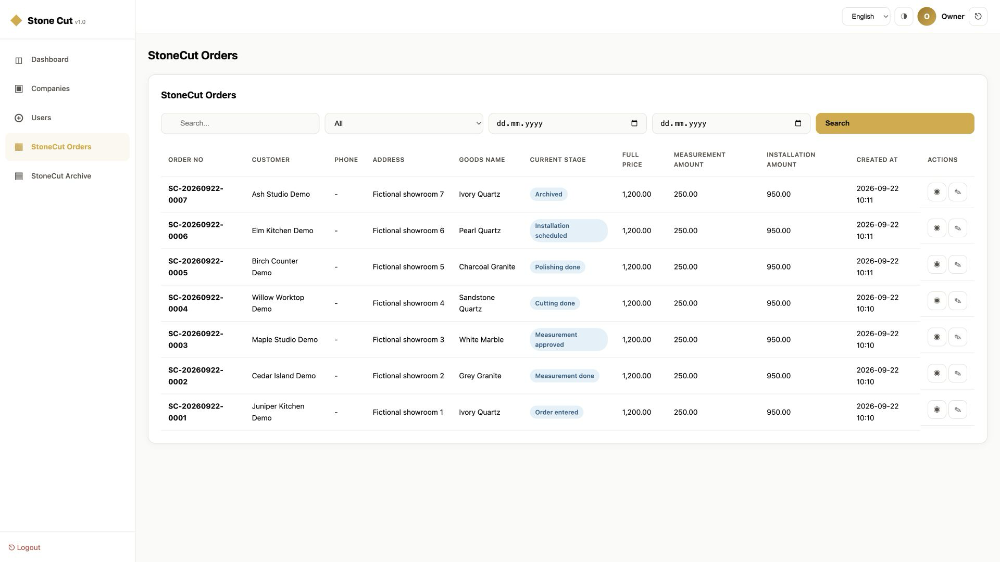
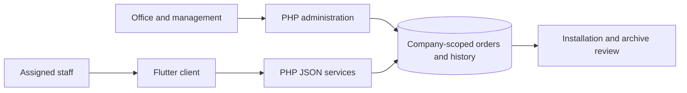
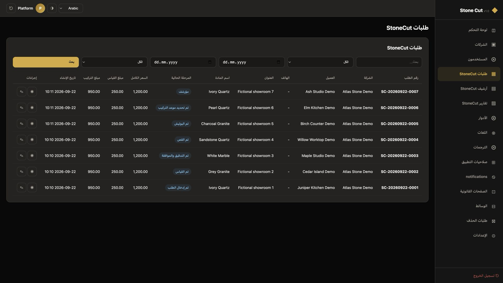
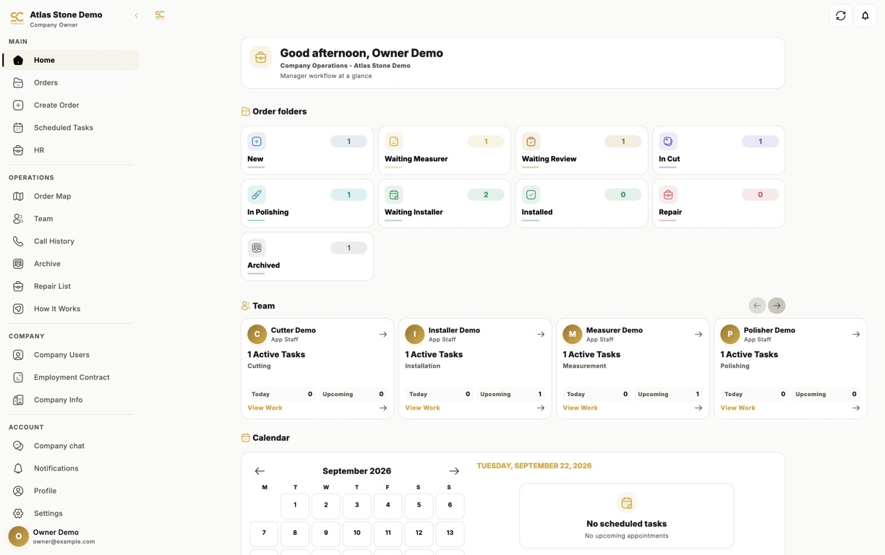
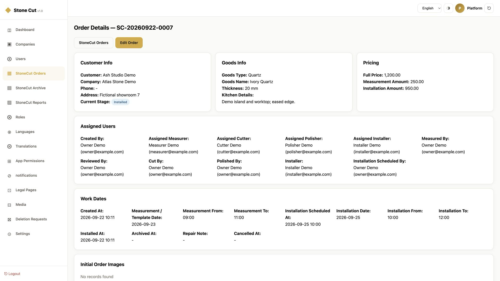
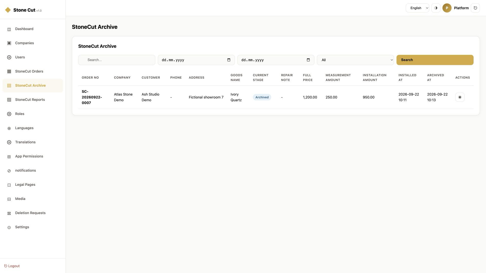
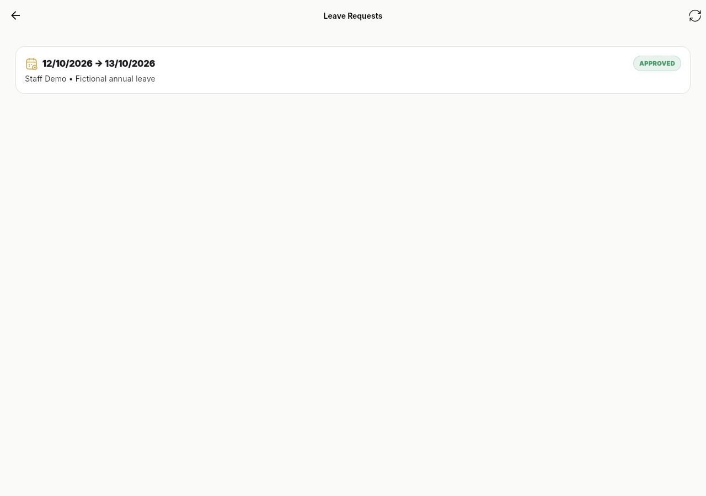
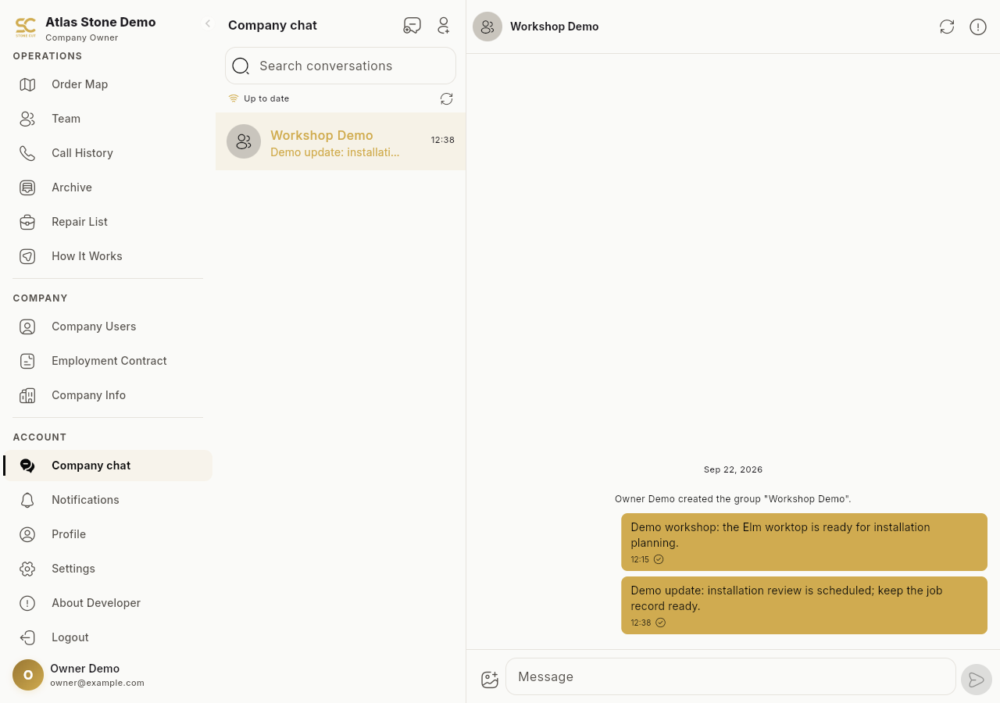

# Stone Cut

An operational platform connecting stone worktop orders, assigned production stages and installation review.

This is a documentation and visual showcase. The application source code is not included. Technical descriptions and earlier test results come from the prepared project documentation; those application tests were not repeated for this export.

**Portfolio:** [English](https://ideabat.com/portfolio/stone-cut-workflow-platform/) · [Türkçe](https://ideabat.com/tr/portfolio/stone-cut-workflow-platform/) · [العربية](https://ideabat.com/ar/portfolio/stone-cut-workflow-platform/)

**Case study:** [English](https://ideabat.com/case-study/stone-cut-multi-stage-workflow/) · [Türkçe](https://ideabat.com/tr/case-study/stone-cut-multi-stage-workflow/) · [العربية](https://ideabat.com/ar/case-study/stone-cut-multi-stage-workflow/)

## Ragıp Mullamusa’s contribution

I developed the PHP backend, relational data model, browser administration and Flutter client, including stage transitions, company and assignment boundaries, English/Arabic interfaces and local workflow verification. The prepared attribution identifies this work with Ideabat. Ownership of the stone business, commercial terms and launch dates are not asserted.

## At a glance

| Area | Delivered shape |
|---|---|
| Users | Company owners, office teams, managers and assigned staff |
| Interfaces | Public website, browser administration and one role-aware Flutter client |
| Persistence | PHP JSON services and MySQL/MariaDB |
| Language | English and Arabic, including RTL; light/dark presentation |
| Evidence | Synthetic order, leave and chat journeys; web and macOS captures |

## From a worktop order to a retained record

The important unit is the order, not an isolated screen. Material and customer details establish what is being made; assignments establish who can act; stage history explains how the job reached its current state. Scheduling and installation completion remain separate from the final management decision to archive or repair.

This is a conceptual responsibility diagram. Company scope and stage validation belong to the backend; the client presents the actions available to a role. Transactions connect the state change with its history entry. REST polling keeps chat consistent with persisted messages without treating optional push delivery as the message store.

## Context and objective

Stone fabrication connects office planning, measurement, workshop production and installation. Each step needs the order's material, responsible people and schedule. Stone Cut addresses this operational structure with shared records and explicit workflow actions. This account describes the implementation, not a commissioned customer research study.

## Users and workflow

An owner, manager or office user creates an order and assigns people to its tasks. Current reference data uses general app staff for assigned work; older specialist role keys remain in compatibility code but are inactive in the supplied database. The application is one Flutter client with role-aware views, not separate trade-specific binaries.

Orders progress through entry, measurement, approval, cutting, polishing and installation scheduling. Installation completion records an installed state. Management then makes an explicit archive or repair decision.

## Architecture and constraints

PHP serves the public site and session-authenticated admin pages. The Flutter client calls bearer-authenticated JSON endpoints. MySQL/MariaDB stores companies, users, orders, assignments and stage history. Stage actions lock and validate an order, update state, and record history in transactions.

The two interfaces need to agree on the same authority rules. Company scope and assignment are enforced in backend helpers; price and customer visibility vary with role and context. A photograph of the UI alone would not prove these checks.

## Engineering and UX decisions

The order detail keeps material, assigned staff and scheduled work visible together. Installation and archive are separate decisions, preserving a final review point. English/Arabic direction handling and theme controls are implemented rather than simulated for the gallery.

## Adjacent operations and integrations

HR code covers contracts, selfie/location attendance, leave, advances and payroll. A local synthetic leave request and owner approval were persisted through the actual API. Attendance capture and payroll completion were not established by that check.

Company chat persists messages in MySQL and synchronizes the foreground client through REST polling. The old WebSocket transport is retired. Optional Firebase push does not replace the message store. Maps, Twilio voice and advertising consent are separate integration boundaries; no live calls, push deliveries or map lookups were performed for this case study.

## Observed delivery evidence

A disposable local company and seven fictional orders were created. The owner-authorized path progressed through production and installation, followed by explicit archiving; the administration panel displayed those records. This uses the existing owner override and does not establish staff signature/media completion. Chat send/history and HR leave review were also exercised locally.

The delivered capability is a connected order and decision history. No time saving, revenue change, customer adoption figure or testimonial is asserted. The selected gallery includes browser captures and a native macOS owner view; other platform coverage remains limited.

## Screen walkthrough

These real application captures come from the project’s prepared publication material. Demonstration records are synthetic; a screen illustrates the interface, not a production deployment or a permission test.

### 01 — Company owner order workspace

### 02 — Arabic operational view

### 03 — The checkout-built native macOS client displays Atlas Stone Demo and assigned task folders.

### 04 — Order detail and assignments

### 05 — Retained completed order

### 06 — A fictional staff leave request appears approved in the Flutter web owner view.

### 07 — The real Flutter web chat displays two locally persisted synthetic workshop messages.

## Evidence and availability

Implementation and historical validation descriptions above are supported by the project’s prepared documentation. The application tests were not rerun for this documentation export. The screenshots demonstrate the captured version, not current service availability, customer adoption or measured commercial outcomes.

## Ownership and technical review

This repository contains documentation and approved visual material, not an application source release. Presentation through Ideabat does not transfer a client’s ownership. For employment, collaboration or technical-review inquiries, contact Ragıp Mullamusa through Ideabat. Access to client-owned source requires prior permission from the project owner and compliance with applicable confidentiality requirements. Requests are reviewed individually; source access is not guaranteed. No software license or redistribution permission is granted by this showcase.

## Contact

Ragıp Mullamusa is the founder of [Ideabat](https://ideabat.com/). For relevant engineering, employment or collaboration inquiries, use [the contact page](https://ideabat.com/contact-us/) or [info@ideabat.com](mailto:info@ideabat.com).
